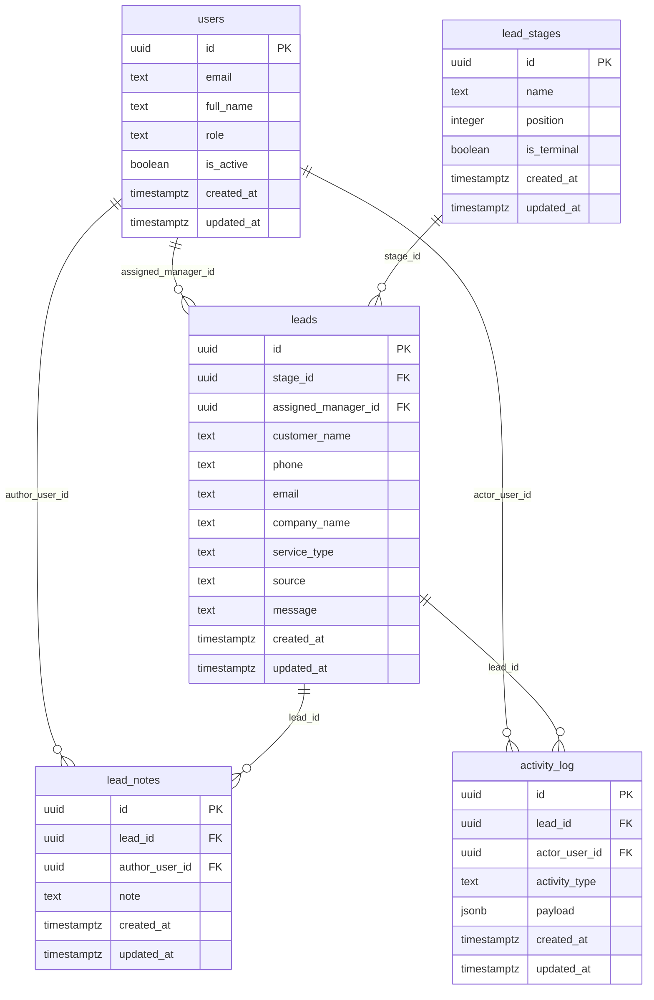

# Sprint 1 CRM MVP ER Summary

This schema supports the first paid-pilot path:

`landing form -> lead saved -> lead appears in CRM -> manager notified -> notes/activity tracked`

## Tables

| Table | Purpose |
|---|---|
| `users` | Internal users: owners, managers, operators, admins. |
| `lead_stages` | Kanban pipeline stages for CRM leads. |
| `leads` | Captured leads from landing, Telegram, or manual entry. |
| `lead_notes` | Manager/operator notes attached to a lead. |
| `activity_log` | Structured lead activity events with JSONB payloads. |

## Relationships

## Required Indexes

| Index | Purpose |
|---|---|
| `leads_stage_id_idx` | Fast Kanban queries by pipeline stage. |
| `leads_assigned_manager_id_idx` | Fast manager workload views. |
| `lead_notes_lead_id_idx` | Fast lead detail note loading. |
| `activity_log_lead_id_idx` | Fast lead activity timeline loading. |

## Default Pipeline Stages

1. `New`
2. `Qualified`
3. `Proposal Sent`
4. `Booked`
5. `Closed Won`
6. `Closed Lost`
